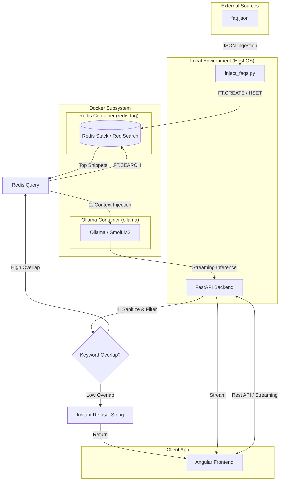

# FAQ Chatbot

An AI-powered FAQ assistant built with **Angular 21** and **FastAPI**. Optimized for **instant responses (<2s)** and **strict adherence** to local knowledge using **Redis Stack (RediSearch)** and **Ollama**.

##  System Architecture

Our architecture ensures 100% strictness by validating keywords before querying the LLM, preventing "hallucinations" about off-topic subjects.



---

##  Key Features

-  **Voice-Reactive Visuals**: Dynamic orb and waveform bars that react to microphone input intensity.
-  **Instant Redis Search**: Uses **RediSearch** full-text lookup to retrieve relevant FAQ snippets in ~1ms.
-  **Strict FAQ Logic**: Python-level keyword validation prevents the bot from answering questions outside the local FAQ (e.g., "visit Kosovo").
-  **Streaming Responses**: Real-time LLM streaming using `smollm2:1.7b` for a seamless chat experience.
-  **Premium Aesthetic**: Modern dark-themed interface built with **Tailwind CSS 4**.

---

##  Tech Stack

- **Frontend**: Angular 21, Tailwind CSS 4, Lucide Angular.
- **Backend**: FastAPI (Python 3.11+).
- **Search Engine**: Redis Stack (RediSearch).
- **LLM Engine**: Ollama (SmolLM2 Instruct).
- **Infrastructure**: Docker Compose.

---

##  Getting Started

### 1. Prerequisites
- [Docker & Docker Compose](https://docs.docker.com/get-docker/)
- [Python 3.11+](https://www.python.org/downloads/)
- [Node.js 20+](https://nodejs.org/)

### 2. Infrastructure Setup (Docker)
Start the Redis and Ollama containers:
```bash
cd FastAPI
docker-compose up -d
```

### 3. Backend Setup
```bash
# Install dependencies
pip install -r requirements.txt

# Inject FAQ data into Redis (Run once or after updating faq.json)
python inject_faqs.py

# Start the FastAPI server
uvicorn main:app --reload
```

### 4. Frontend Setup
```bash
# Return to root directory
cd ..

# Install dependencies
npm install

# Run the project
npm start
```

---

##  Project Structure

- `FastAPI/main.py`: Core backend logic with Redis retrieval and strict validation.
- `FastAPI/inject_faqs.py`: Utility to index `faq.json` into Redis search.
- `src/app/app.ts`: Frontend chat orchestration and audio analysis.
- `src/app/app.html`: Visual interface for the assistant.

##  Project Context
Developed as part of the PFE (Projet de Fin d'Études) to demonstrate optimized RAG (Retrieval-Augmented Generation) patterns for lightweight, instant-reply chatbots.
